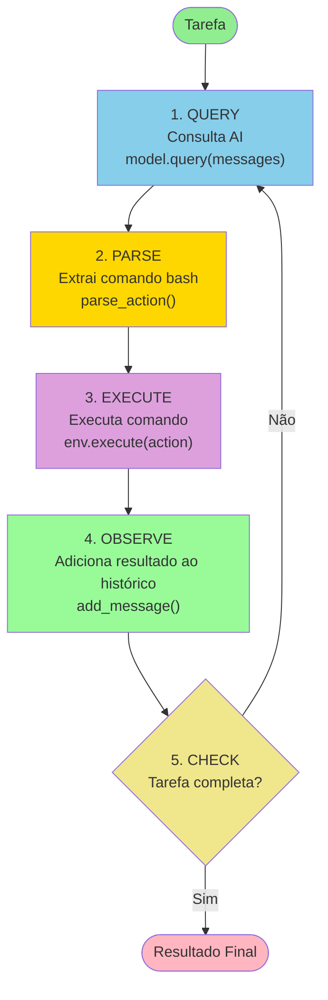

Este repositório é um fork do [mini-swe-agent](https://github.com/SWE-agent/mini-swe-agent) que suporta agentes [Stackspot](https://stackspot.com/) através da _model class_ `stk`.

### Pré-requisitos

Você precisa configurar as seguintes variáveis de ambiente:

- `STK_CLIENT_ID`: Seu Client ID do Stackspot
- `STK_CLIENT_SECRET`: Seu Client Secret do Stackspot
- `STK_REALM`: O Realm do Stackspot (ex.: `stackspot`)

### Uso

Fazendo o setup usando uv:

```bash
uv venv
source .venv/bin/activate
uv pip install -e .
```

Você pode usar o comando especializado `mini-stk`

```bash
uv run mini-stk --agent-id <seu-agent-id>
```

## Loop de agente


